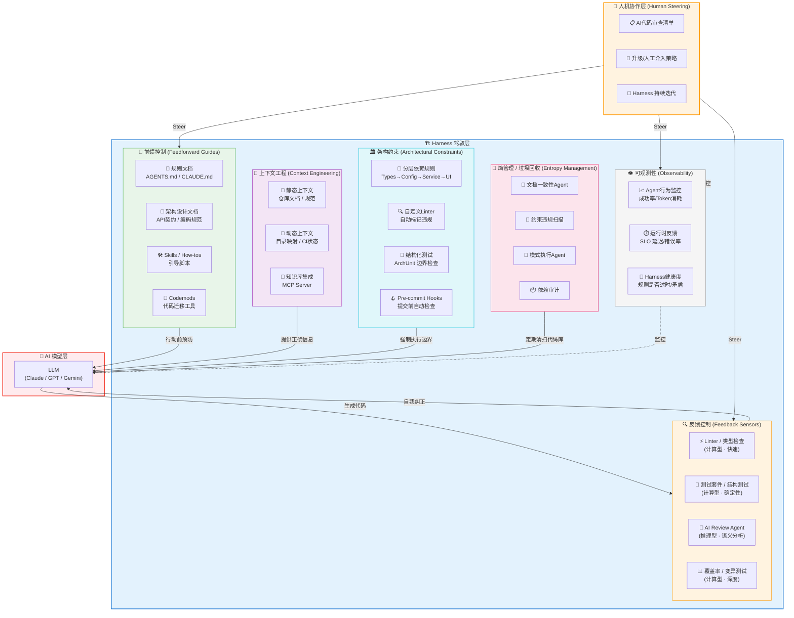
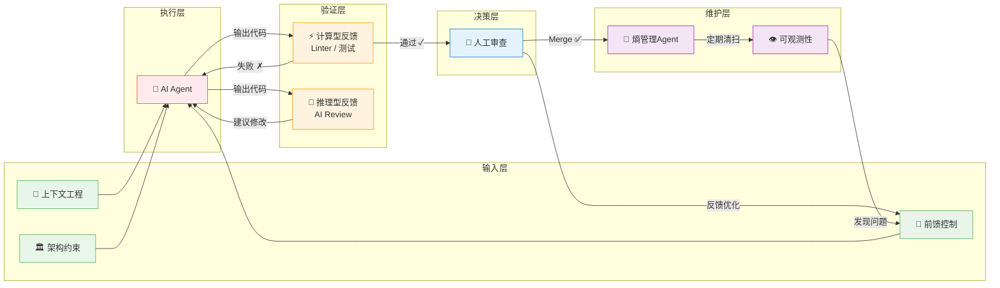
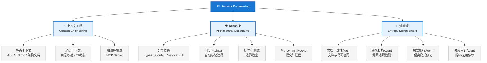

# Harness Engineering 架构图

## 核心公式

$$\text{Agent} = \text{Model} + \text{Harness}$$

---

## 整体架构图

---

## 数据流架构图

---

## 三大支柱详解

---

## 一句话总结

> **给信息（上下文）→ 定边界（架构约束）→ 抓错误（反馈回路）→ 清垃圾（熵管理）→ 看全局（可观测性）→ 人兜底（协作层）**
